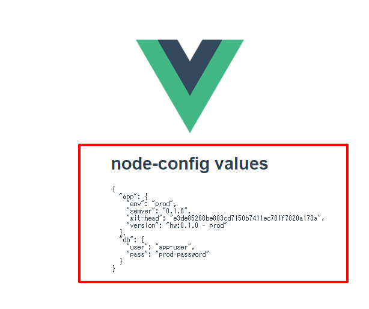

Webアプリ、CLI、バッチ等の開発者対象に、3code流Nodejsミニマム開発アーキの決定版を紹介します。OSSの有名プロダクトを多分に参考にしているので、Nodejs初学者はもちろん、中級者の方にも参考にしてもらえるプラクティスがあるかと思います。

## Problem
コードのLinting、ユニットテスト、Commitメッセージ。。開発アーキには地味に考えないといけないことがたくさんありますが、この領域はこだわりだすときりがなく、ネットで検索しても網羅性の高い情報になかなか出会えません。

ツールの選択肢が多いことも相まって、必要性は感じつつもつい先延ばしにしてしまいがちな領域です。

<SampleCodeNote />

## Solution
そこでミニマムかつ網羅性のある開発アーキを紹介します。

Type Scriptは利用しません。個人的にな嗜好ですが言語のメタ拡張が基本好きになれないので。

以下の点に重点を置いています。

* 可能な限り有名OSSのプラクティスを参考
    * チームメンバーが仕事をしつつ一般的なプラクティスを学べる環境作り
* ドキュメントがしっかりしているツール群を採用
    * ドキュメンティングコストを最小化する（社内ドキュメントがリンク集で済むようにする）
* Write once, run anywhere
    * 追加のMW(SonarQube)や、特定の状況(IDEの機能）に依存しない。ローカルで完結し、CIでも同じプロセスを使える

最終結果のみ記載します。各項目の詳細の説明は[Discusion](#discusion)の章で説明します。

1. **[nvm](https://github.com/nvm-sh/nvm)を使い、[.nvmrc](https://github.com/nvm-sh/nvm#nvmrc)でnodeのバージョンを固定**

1. **Package mangaerには[yarn](https://classic.yarnpkg.com/en/)を採用**

1. **Config, Secret管理には[node-config](https://github.com/lorenwest/node-config)を採用**

    <small>以下のように、慣れ親しんだ形で設定を管理することができます。</small>
    
    ::: vue
    i$PROJECT_ROOT/config/
    ├── custom-environment-variables.js *(環境変数から注入する変数の定義)*
    ├── default.js *(共通設定の定義)*
    └── production.js *(環境固有)*
    :::

1. **[Airbnb Style Guide](https://github.com/airbnb/javascript/blob/master/README.md)を採用し、一般普及しているベストプラクティスを適用**

1. **[EditorConfig](https://editorconfig.org/)でエディターレベルでTextフォーマットを強制**

   <<< @/3code-tech-blog/docs/sample-code/tech/javascript/nodejs-development/.editorconfig


1. **[ESLint](https://eslint.org/)でCode Styleを強制**

    <small>ミニマム設定として以下になります。Airbnn Style, Jestの設定も追加されます</small>

   <<< @/3code-tech-blog/docs/sample-code/tech/javascript/nodejs-development/.eslintrc.js

1. **Jestでユニットテスト**

1. **[Conventional Commits](https://www.conventionalcommits.org/en/v1.0.0/)でコミットメッセージ体系化する**

    <small>コミット履歴が体系化されることに加え、CHANGELOGも自動生成することができます。[メッセージのLinting](#lint-conventional-commits)も実施します。</small>

1. **Githookによる自動チェック**

    <small>commit時にGit stagedのファイルにeslintで自動fixをかけ、Jestを走らせます。かつcommit messageにlintを自動でかけます</small>

    ```json
    // package.json(中略)

      "husky": {
        "hooks": {
          "pre-commit": "lint-staged",
          "commit-msg": "commitlint -E HUSKY_GIT_PARAMS"
        }
      },
      "lint-staged": {
        "**/*.js": [
          "eslint --fix",
          "jest --bail --findRelatedTests",
          "git add"
        ]
      },
    ```

1. **VScode Setup**

    <small>[Workspace recommended extensions](https://code.visualstudio.com/docs/editor/extension-gallery#_workspace-recommended-extensions)でExtensionsをチームで共有。[Jestのための設定](#jestのための設定)も追加します</small>

    <<< @/3code-tech-blog/docs/sample-code/tech/javascript/nodejs-development/.vscode/extensions.json

1. ドキュメントは[VuePress](https://vuepress.vuejs.org/)で管理

## Discusion
[Solutionの章](#solution)の 各項目について詳細を説明してきます。なかなかのボリュームになっているので、必要な項目だけでも参考にしていただければ幸いです。

本テーマは`ミニマム`である。ということなので、極力OSSの資産をOOTBで活用します。また、例えばコードスタイルのLintingではESLintと(Prettier)[https://prettier.io/]の組み合わせが主流ですが、個人的にはToo muchだと思っているのと、補助ツールが増えると設定が肥大化して、コートベースの威圧感が強くなるので採用していません。


### nvmを使い、.nvmrcでnodeのバージョンを固定
[nvm(node version manager)](https://github.com/nvm-sh/nvm)を組み込みます。[.nvmrc](https://github.com/nvm-sh/nvm#nvmrc)にプロジェクトで利用するnodeのversionを記載しておくことで、以下のように各開発者が同じバージョンを利用できます。

```bash
$ cat .nvmrc
12.16.3

$ nvm install
Found '/home/vagrant/bitbucket/3code-tech-blog-src/packages/blogs/3code-tech-blog/docs/sample-code/tech/javascript/nodejs-development/.nvmrc' with version <12.16.3>
Downloading and installing node v12.16.3...
Local cache found: ${NVM_DIR}/.cache/bin/node-v12.16.3-linux-x64/node-v12.16.3-linux-x64.tar.xz
Checksums match! Using existing downloaded archive ${NVM_DIR}/.cache/bin/node-v12.16.3-linux-x64/node-v12.16.3-linux-x64.tar.xz
Now using node v12.16.3 (npm v6.14.4)

$ nvm use
Found '/home/vagrant/bitbucket/3code-tech-blog-src/packages/blogs/3code-tech-blog/docs/sample-code/tech/javascript/nodejs-development/.nvmrc' with version <12.16.3>
Now using node v12.16.3 (npm v6.14.4)

$ node --version
v12.16.3
```

チームに使うべきNodejsのバージョンをシステマティックに共有でき、アプリの品質が高くなります。

### Package mangaerにはyarnを利用
別の記事で紹介予定ですが、[yarn workspace](https://classic.yarnpkg.com/blog/2017/08/02/introducing-workspaces/)は非常に便利です。

今後monorepo化の動きは大きくなるはずなので、yarnのワークフローに慣れておくためにも、yarnを採用しましょう。他にも便利な点をあげておきます

* `node_modules`を良しなにキャッシュしてくれるので、複数プロジェクトを同時開発している場合非常に開発効率があがる
* npm scriptを`run`サブコマンドなしで実行できる。`npm run build` -> `yarn build`。地味ながら非常に便利

### Config, Secret管理にはnode-configを採用
悩ましきConfig(設定)の管理は、[node-config](https://github.com/lorenwest/node-config)を採用します。

Nodejs, Config管理周辺の調査をすると、大概は[dotenv](https://github.com/motdotla/dotenv)にたどり着くと思われます。dotenvは[12 factor app](https://12factor.net/ja/config)にも準拠しており、理想的なソリューションであると考えられますが、実際にプロジェクトに採用してみると不便な点が出てきます。

* `.env`ファイルのGit(version control)への格納は非推奨である([FAQ](https://github.com/motdotla/dotenv#should-i-commit-my-env-file))
* 結果`.env`ファイルの生成は、CI/CDプロセスに組み込むなど何かしら追加の対応が必要になる
* 結局のところ、開発者はコードベース内に環境毎のconfigが管理されており、grepできることを好む

参考に有名フレームワークのdotenvとの統合部分をみてみます。例えば[Vue(CLI)](https://cli.vuejs.org/guide/mode-and-env.html)ではコミットしていい.envファイルと、シークレット用のためにコミットしてはいけない.envファイルを別個に扱えるようにするなど独自の拡張をしています。

ユースケースベースで考えれば有益な拡張であると思いますが、本家の思想を崩してしまうのは何とも気持ちが悪いものです。より適した思想のモジュールを選ぶべきではないでしょうか。

[node-config](https://github.com/lorenwest/node-config)がその答えであり、一般普及の観点からいっても申し分ないです。加えて、[Config内で関数が使えたり](https://github.com/lorenwest/node-config/wiki/Special-features-for-JavaScript-configuration-files#deferred-values-in-javascript-configuration-files)、[環境変数から設定値を取得できたり](https://github.com/lorenwest/node-config/wiki/Environment-Variables#custom-environment-variables)など、痒い所に手が届く機能が実装されています。

では簡単に動作検証をしてみます。


まず、以下のようにconfigファイルを準備します。
::: vue
$PROJECT_ROOT/config/
├── custom-environment-variables.js *(環境変数から注入する変数の定義)*
├── default.js *(共通設定の定義)*
└── production.js *(環境固有)*
:::

共通設定として、[Config内で関数が使える機能](https://github.com/lorenwest/node-config/wiki/Special-features-for-JavaScript-configuration-files#deferred-values-in-javascript-configuration-files)を利用しアプリケーション情報を設定しています。

<<< @/3code-tech-blog/docs/sample-code/tech/javascript/nodejs-development/config/default.js{10-12}

環境固有の情報を`${NODE_ENV}.js`ファイルに設定します。これは`NODE_ENV=production node index.js`といったように、実行時に指定したNODE_ENVの値とマッチングしたファイルがnode-configによってピックアップされ、直観通りにオーバライドされます。

<<< @/3code-tech-blog/docs/sample-code/tech/javascript/nodejs-development/config/production.js


DBの接続パスワードはシークレットになるので、[環境変数から取得するように指定します](https://github.com/lorenwest/node-config/wiki/Environment-Variables#custom-environment-variables)。これは`config/custom-environment-variables.js`を配置し、valueに環境変数名を設定します。

この1ファイルを見れば、設定すべき環境変数を把握することができる点も利点の1つです。

<<< @/3code-tech-blog/docs/sample-code/tech/javascript/nodejs-development/config/custom-environment-variables.js

動作確認用のjsを実行してみます。

<<< @/3code-tech-blog/docs/sample-code/tech/javascript/nodejs-development/scripts/node-config.js

```bash
# ローカル開発環境で実行
$ DB_PASS=password node scripts/node-config.js
{
  "app": {
    "env": "local",
    "semver": "1.0.0",
    "git-head": "144675283c27f1d4fbc88484435ae1337673df04",
    "version": "dev-arch:1.0.0 - local"
  },
  "db": {
    "user": "app-user",
    "pass": "password"
  }
}


# 本番環境で実行
$ NODE_ENV=production DB_PASS=prod-password node scripts/node-config.js
{
  "app": {
    "env": "prod",
    "semver": "1.0.0",
    "git-head": "144675283c27f1d4fbc88484435ae1337673df04",
    "version": "dev-arch:1.0.0 - prod"
  },
  "db": {
    "user": "app-user",
    "pass": "prod-password"
  }
}
```

期待通り`app.env`は環境固有ファイルから取得され、`db.pass`は環境変数から注入されていることがわかります。AWS LambdaなどのFaaSも同じ仕組みを利用できるので、Config管理の仕組みを統一化することできます。

#### Frontendでの利用
ここで、Frontendはどうすればいいの？という疑問がでてくるのではないでしょうか。本ブログは[Vue.js](https://jp.vuejs.org/index.html)を推しているので、前述した[Vue CLI](https://cli.vuejs.org/)との統合方法を紹介します。

node-configのwikiの[Webpack Usage](https://github.com/lorenwest/node-config/wiki/Webpack-Usage)の答えがあるのですが、これのOption 1で実装します。これはWebpackの[DefinePlugin](https://webpack.js.org/plugins/define-plugin/)によって、Configの設定値をビルド時にグローバルスコープの定数として埋め込み、コード内で利用できるようにしてくれます。

Vue CLIでは[Webpackの設定を拡張](https://cli.vuejs.org/guide/webpack.html)することができます。[GitHub](https://github.com/vuejs/vue-cli/issues/1647#issuecomment-459650275)でのQAを参考に実装を行ってみます。

Webpack DefinePluginで、`node-config`を登録します。
```js{6}
// $PROJECT_ROOT/vue.config.js

module.exports = {
  chainWebpack: config => {
    config.plugin('define').tap(definitions => {
      definitions[0]['process.env']['config'] = JSON.stringify(require("config"));
      return definitions;
    })
  }
}
```

コードでは以下のように`process.env.config`経由で設定値を利用できます。
```js {6-7,15-18}
// src/components/HelloWorld.vue

<template>
  <div class="hello">
    <h1>node-config values</h1>
    <!-- 値の表示 -->
    <pre>{{ config }}</pre>
  </div>
</template>

<script>
export default {
  name: 'HelloWorld',
  computed: {
    // 登録したnode-configを取得
    config() {
      return JSON.stringify(process.env.config, null, 2);
    },
  },
};
</script>
```

ビルドを実行し、画面を表示します。
```
$ NODE_ENV=production DB_PASS=prod-password yarn build

$ npx serve -d dist/
```



FrontendでもWebpackに簡単な設定を追加することで期待通りの結果が得られることがわかります。

FrontendもBackendも同じ管理の仕組みを採用することで、`どこに何の設定があるか`が統一され、開発者のストレス、ドキュメンティングのコストを軽減することができます。

::: warning 注記
以下を厳守できれば、 [12 factor app](https://12factor.net/ja/config)に違反していない。と解釈したうえでのアーキです。

> アプリケーションがすべての設定をコードの外部に正しく分離できているかどうかの簡単なテストは、認証情報を漏洩させることなく、コードベースを今すぐにでもオープンソースにすることができるかどうかである。
:::

### Airbnb Style Guideを採用し、一般普及しているベストプラクティスを適用

コードスタイルを選ぶうえで以下を重視しています

* 理由を含め記載されているドキュメントが完備されている
* Lintingの設定が付属している
* 一般的に普及している(開発者が勉強する価値がある)

私は某大手外資コンサルタントのシステム部隊にいますが、コードスタイルをプロジェクト毎に個別に定義してドキュメンティングしていたりします。当然過不足があり、謎のプラクティスなどが組み込まれていたりします。当然Linterの設定もまともにありません。

謎の車輪の再発名をせず、ワールドワイドに普及しているプラクティスを採用しましょう。

結果`Airbnb Style Guide` を採用します。なぜかというと、[GitHub](https://github.com/airbnb/javascript/tree/master/packages/eslint-config-airbnb-base)をみてもらうとわかるように、コントリビュータの数が多いことと、**なりよりも[ガイド](https://github.com/airbnb/javascript)が充足** しており、各言語の[翻訳](https://github.com/airbnb/javascript#translation)があることです。もーこれだけで自前のコードフォーマットガイドの作成が不要になります。もし変更点があるのであれば、そこだけを社内のドキュメントに注記すればよいのです。

### EditorConfigでエディターレベルでTextフォーマットを強制
もはや説明も不要かもしれませんが、Textフォーマットは[EditorConfig](https://editorconfig.org/)を使ってEditorに強制させましょう。

`$PROJECT_ROOT/.editorconfig`というファイルをGitにコミットしておけば、各々のEditor、IDEで同設定のTextのフォーマットでの編集が可能で、チーム間でも簡単に共有できます。

まだチームの導入していないなら、TextフォーマットはEditorConfigを使う。という文化を一刻も早く取り入れましょう。まちがっても、開発環境セットアップガイドにIDEのEditor設定をキャプチャーを貼るような愚行は避けましょう。

ポイントは以下です
1. eslintのairbnbの設定にあわせましょう
2. Markdownは末尾のspaceで改行を表現できるので、`trim_trailing_whitespace`は`false`に設定しましょう。

<<< @/3code-tech-blog/docs/sample-code/tech/javascript/nodejs-development/.editorconfig{17}

### ESLintでCode Styleを強制
Javascriptの世界では完全にデファクトスタンダードです。コードスタイルはもちろん、バグが発生しやすいコードも検知してくれ、細かいチューニングも可能です。


#### Initizlize
EslintのCliで初期設定を行います。対話形式で設定可能なので適切な回答を選択してください。以下がおすすめの設定です。

```bash
$ npx eslint --init
? How would you like to use ESLint? To check syntax, find problems, and enforce code style
? What type of modules does your project use? CommonJS (require/exports)
? Which framework does your project use? None of these
? Does your project use TypeScript? No
? Where does your code run? Browser
? How would you like to define a style for your project? Use a popular style guide
? Which style guide do you want to follow? Airbnb: https://github.com/airbnb/javascript
? What format do you want your config file to be in? JavaScript
Checking peerDependencies of eslint-config-airbnb-base@latest
The config that you've selected requires the following dependencies:

eslint-config-airbnb-base@latest eslint@^5.16.0 || ^6.8.0 eslint-plugin-import@^2.20.1
? Would you like to install them now with npm? Yes
Installing eslint-config-airbnb-base@latest, eslint@^5.16.0 || ^6.8.0, eslint-plugin-import@^2.20.1
npm WARN dev-arch@1.0.0 No description
npm WARN dev-arch@1.0.0 No repository field.

+ eslint-config-airbnb-base@14.1.0
+ eslint-plugin-import@2.20.2
+ eslint@6.8.0
updated 3 packages and audited 196 packages in 5.334s

1 package is looking for funding
  run `npm fund` for details

found 0 vulnerabilities

Successfully created .eslintrc.js file in /home/3code/nodejs-development

```

何点かポイントを説明します。

#### `Which style guide do you want to follow?`
前項で説明したとおり、`Airbnb` を選択します。

#### `? What format do you want your config file to be in?`
`JavaScript`をお勧めします。有名どころをみていてもJavascriptかJsonが多いので、コピペのしやすさからいずれかの選択肢になりますが、Javascript出かけたほうがquoteをしなくてよい分記述量が減るのでJavascriptをお勧めします。なんとなく`Yaml`にしがちですが、その誘惑に負けないようにしましょう。

#### 実行方法
ここではCLIでの実行方法を説明します。CI処理と統合する際の参考にしてください。Gitアクティビティとの統合については後の章で紹介します。

以下2つのjsスクリプトを例にとります。

`good.js`: 問題なし
```js
const foo = 'with semicolon';

process.stdout.write(`${foo}\n`);
```

`no_good.js`: 問題あり
```js
const bar = 'missing semicolon'

 console.log(bar);
```

#### Lint check
```bash
$ npx eslint . --ext .js


/home/vagrant/new-work/dev-arch/no_good.js
  1:32  error    Missing semicolon                             semi
  3:1   error    Expected indentation of 0 spaces but found 1  indent
  3:2   warning  Unexpected console statement                  no-console

✖ 3 problems (2 errors, 1 warning)
  2 errors and 0 warnings potentially fixable with the `--fix` option.

$ echo $?
1
```

#### Automatically fix problems
```bash
$ npx eslint . --ext .js --fix

/home/vagrant/new-work/dev-arch/no_good.js
  3:1  warning  Unexpected console statement  no-console

✖ 1 problem (0 errors, 1 warning)

```

すると以下のように、semicolonが付与され、インデントのずれがFixされます。

```diff
$ git diff no_good.js
diff --git a/no_good.js b/no_good.js
index 2eadcbe..88c7436 100644
--- a/no_good.js
+++ b/no_good.js
@@ -1,3 +1,3 @@
-const bar = 'missing semicolon'
+const bar = 'missing semicolon';

- console.log(bar);
+console.log(bar);
```

これで大雑把エンジニアへのストレスから解放されそうです。

ここで一点問題があります。`warning`はfixされないということです。この例でいうと、`console.log(...)`はそのまま残っており、warningが表示されます。

これは[no-console](https://eslint.org/docs/rules/no-console)というルールで、Browser環境で実行されるJavascriptのためのルールになっており、Nodejs環境においてはdisableにしても問題ない旨が記載されています。

> **When Not To Use It**  
If you're using Node.js, however, console is used to output information to the user and so is not strictly used for debugging purposes. If you are developing for Node.js then you most likely do not want this rule enabled.  

ドキュメントに従い以下の1行をconfigに追加することで`diabled`にすることは可能です。

```diff
$ git diff .eslintrc.js
diff --git a/.eslintrc.js b/.eslintrc.js
index e796b06..c051fae 100644
--- a/.eslintrc.js
+++ b/.eslintrc.js
@@ -15,5 +15,6 @@ module.exports = {
     ecmaVersion: 2018,
   },
   rules: {
+   'no-console': 'off'
   },
 };
```

が。ここからは好みにもよりますが、個人的にはこれは`disabled`にすべきではないと思っています。理由は2点あります。
1. `console.log(...)`はjavascriptにおける従来からのprint debugの手法であるため、開発者のdebug目的なのか、アプリケーションとしての適切なアウトプットなのかが区別できなくなる
2. FrontendのJavascriptでは禁止することになるため、極力console.logを使わない習慣を開発者につけさせる

1番でいえば、開発者のprint debugコードが残っており本番環境で個人情報をログに書きこんでしまった。といった事故を多少なりと軽減することができます。

ということで、以下のような対応をお勧めしています。

#### ロギング用コードを作成

`lib/logger.js`: Eslintのルール制御コメント記法を使い、ファイル単位でno-consoleルールをdisabledにします。
```js{1}
/* eslint-disable no-console */

exports.info = (msg) => console.log(msg);
exports.warn = (msg) => console.warn(msg);
exports.error = (msg) => console.error(msg);

```

`no_good.js`を作成した`lib/logger.js`を使うように変更。
```js{1,5}
const logger = require('./lib/logger');

const bar = 'missing semicolon';

logger.info(bar);
```

再度ESLintを実行すると警告がなくなります。

ここでprint debugコードが仕込まれたとします。
```diff
$ git diff no_good.js
diff --git a/no_good.js b/no_good.js
index a159f7d..70764a8 100644
--- a/no_good.js
+++ b/no_good.js
@@ -3,3 +3,4 @@ const logger = require('./lib/logger');
 const bar = 'missing semicolon';

 logger.info(bar);
+console.log(`debug ${bar}`);

```

改めてESLintを実行すると、以下のように明示的ににloggerを使っていない(print debugの可能性が高い)コードが混入したとしてwarningを吐くことができます。終了コードも0以外になるため、CICD環境が整っている場合そこで塞き止めることができます。

```bash
$ npx eslint . --ext .js

/home/vagrant/new-work/dev-arch/no_good.js
  6:1  warning  Unexpected console statement  no-console

✖ 1 problem (0 errors, 1 warning)

$ echo $?
130

```

### Jestでユニットテスト

テストフレームワークには[Jest](https://jestjs.io/ja/)を使います。現在のデファクトといって問題ないと思いますので、詳細は割愛します。

一点補足として、Jest用の設定をESLintに追加してあげないと、Jestが自動で登録してくる関数群がESLintでエラーになってしまいます。

```bash
$ npx eslint __test__/sanity.spec.js

/home/vagrant/new-work/dev-arch/__test__/sanity.spec.js
  1:1  error  'describe' is not defined  no-undef
  2:3  error  'test' is not defined      no-undef
  3:5  error  'expect' is not defined    no-undef

✖ 3 problems (3 errors, 0 warnings)
```

以下の追加設定で解消できます。
```diff
# Jest用のPluginをインストール
$ yarn add -D eslint-plugin-jest

# ESLintの設定を修正
$ git diff .eslintrc.js
diff --git a/.eslintrc.js b/.eslintrc.js
index e796b06..037b4bf 100644
--- a/.eslintrc.js
+++ b/.eslintrc.js
@@ -3,6 +3,7 @@ module.exports = {
     browser: true,
     commonjs: true,
     es6: true,
+    'jest/globals': true
   },
   extends: [
     'airbnb-base',
@@ -14,6 +15,7 @@ module.exports = {
   parserOptions: {
     ecmaVersion: 2018,
   },
+  plugins: ['jest'],
   rules: {
   },
 };

```

### Conventional Commitsでコミットメッセージ体系化する
[Conventional Commits](https://www.conventionalcommits.org/en/v1.0.0/)に仕様が展開されていますが、同仕様に従うことで関連ツール群が利用できます。とりわけ[conventional-changelog-cli](https://github.com/conventional-changelog/conventional-changelog/tree/master/packages/conventional-changelog-cli)は、メッセージのLintをしてくれつつ、GitとコミットとGitのタグをベースにCHANGELOGを自動で作成してくれる便利ツールです。

`type`、`scope`などある程度自由度がある項目があるので、具体仕様として[Angularの規約](https://github.com/angular/angular/blob/22b96b9/CONTRIBUTING.md#type)の利用をお勧めします。

#### CHANGELOGの作成
[conventional-changelog-cli](https://github.com/conventional-changelog/conventional-changelog/tree/master/packages/conventional-changelog-cli)でCHANGELOGを生成する流れを説明します。


同CLIを実行すると、リポジトリーのルートにあるCHNAGELOG.md(名前は変更可能)に変更内容を追記してくれます。変更内容はsemverに準じた最後のgit tag以降の変更内容を、Conventional Commitsの規約に従い出力をしてくれます。

> This will not overwrite any previous changelogs. The above generates a changelog based on commits since the last semver tag that matches the pattern of "Feature", "Fix", "Performance Improvement" or "Breaking Changes".

まず初期リリースとして以下のように実行をしたとします。
```bash
$ yarn version --new-version 1.0.0
npx: installed 1 in 1.252s
yarn version v1.22.4
info Current version: 0.0.1
info New version: 1.0.0
Done in 0.07s.

# Do something to release..

$ git log --oneline
638fc79 (HEAD -> master, tag: v1.0.0) v1.0.0
0f54e84 feat: integrate Eslint
85698bc fix: fix typo
70c95aa initial commit

$ git tag
v1.0.0
```

この状態で、`$ npx conventional-changelog -p angular -i CHANGELOG.md -s -r 0`とコマンドを実行すると、以下のように最初のCHANGELOGが生成されます。

```md
# [1.0.0](/compare/85698bc71fcc2cb4506a9e83e00f18053b0cb491...v1.0.0) (2020-06-03)


### Bug Fixes

* fix typo 85698bc


### Features

* integrate Eslint 0f54e84
```

更に追加で変更を加え次期リリースが完了した後、再度CHANGELOGを作成します。

```bash
$ yarn version --new-version 1.1.0
npx: installed 1 in 1.217s
yarn version v1.22.4
info Current version: 1.0.0
info New version: 1.1.0
Done in 0.06s.

$ git log --oneline
a2943e2 (HEAD -> master, tag: v1.1.0) v1.1.0
0f92985 fix: bug fix
f1202ef feat: improve functionality
e4d1493 style: fix Readme.md style
638fc79 (tag: v1.0.0) v1.0.0
0f54e84 feat: integrate Eslint
85698bc fix: fix typo
70c95aa initial commit

$ git tag
v1.0.0
v1.1.0

$ npx conventional-changelog -p angular -i CHANGELOG.md -s -r 2
```

以下のように前回のリリース(tag: v1.0.0)からの更新分がCHANGELOGに追記されます。
```md
# [1.1.0](/compare/v1.0.0...v1.1.0) (2020-06-03)


### Bug Fixes

* bug fix 0f92985


### Features

* improve functionality f1202ef


# 1.0.0 (2020-06-03)


### Bug Fixes

* fix typo 4bc3a41


### Features

* integrate Eslint b2bc523
```

#### Lint Conventional Commits
[Lint your conventional commits](https://github.com/conventional-changelog/commitlint/tree/master/%40commitlint/config-conventional)によりコミットメッセージをConventional Commitのフォーマットに沿っているかをチェックすることができます。

[vuepress](https://github.com/vuejs/vuepress/blob/0854987916cfbfe7f074559de8669d2143c934af/.commitlintrc.js)を参考にconfigファイルを以下のように設定しています

<<< @/3code-tech-blog/docs/sample-code/tech/javascript/nodejs-development/.commitlintrc.js{9}

ハイライトの箇所に、[scope](https://github.com/angular/angular/blob/22b96b9/CONTRIBUTING.md#scope)の文字列を記載することで、プロジェクトで定義したスコープもLintにかけることが可能です。

CLIでコミットmessageのフォーマットチェックを実行してみます。

```bash
# 正しい形式の場合エラーにならない
$ echo "feat: description" | npx commitlint

# typo(feat -> faet)など、フォーマットエラーがあるとエラーになる
$ echo "faet: description" | npx commitlint
⧗   input: faet: description
✖   type must be one of [build, chore, ci, docs, feat, fix, improvement, perf, refactor, revert, style, test] [type-enum]

✖   found 1 problems, 0 warnings
ⓘ   Get help: https://github.com/conventional-changelog/commitlint/#what-is-commitlint
```

#### どの程度のレベル感で厳守すべきか
[FAQ](https://www.conventionalcommits.org/en/v1.0.0/#how-should-i-deal-with-commit-messages-in-the-initial-development-phase)にも記載がありますが、開発初期から取り入れるべきルールです。日々実行することで、慣れ親しむことができます。OSSでも採用しているプロジェクトが増えているので、教育コスト分のリターンはあると考えます。

> **How should I deal with commit messages in the initial development phase?**  
We recommend that you proceed as if you’ve already released the product. Typically somebody, even if it’s your fellow software developers, is using your software. They’ll want to know what’s fixed, what breaks etc.

とはいえ、コミットメッセージを毎回考えるのはToo matchになりかねません。同じく[FAQ](https://www.conventionalcommits.org/en/v1.0.0/#do-all-my-contributors-need-to-use-the-conventional-commits-specification)にあるように、すべての開発者が実施する必要はなく、本流ブランチへのマージをするリードの責務のする。というワークフローも考えれます。こちらはGitのブランチ戦略や、マージストラテジーと関連するので、プロジェクトの特性にあわせて最適な回答を探す必要があります。

> **Do all my contributors need to use the Conventional Commits specification?**  
No! If you use a squash based workflow on Git lead maintainers can clean up the commit messages as they’re merged—adding no workload to casual committers. A common workflow for this is to have your git system automatically squash commits from a pull request and present a form for the lead maintainer to enter the proper git commit message for the merge.


### Git Hookにより自動チェック
ここまでコード、Gitコミットのフォーマットを定義し、Linterの設定も行ってきました。CIプロセスに統合するのはもちろんですが、CIの結果を待っているようでは生産スピートが上がりません。「必ずコミット前に〇〇のコマンドを実行してください」などと声をかけ続けるのも精神衛生上よくないので、よりシステマティックに水際対策を入れていきます。

* [husky](https://github.com/typicode/husky)によるGitアクティビティのHookを導入し
* [lint-staged](https://github.com/okonet/lint-staged)により、Lint対象をGit Stageにいるファイルに限定します


moduleをインストールします。
```bash
$ yarn add -D husky lint-staged
```

package.jsonに設定を追加します。

`$ git commit`時にESLintで自動fixをかけ、かつcommit messageにlintを自動でかけます。
```json
// package.json(中略)
...
  
  "husky": {
    "hooks": {
      "pre-commit": "lint-staged",
      "commit-msg": "commitlint -E HUSKY_GIT_PARAMS"
    }
  },
  "lint-staged": {
    "**/*.js": [
      "eslint --fix",
      "jest --bail --findRelatedTests",
      "git add"
    ]
  },
```

まずはpre-commit HookによるESLint自動実行の動作確認をします。

```bash
# semicolonをつけ忘れたjsを用意
$ cat new-no-good.js
const missingSemicolonVar = 0

process.exit(missingSemicolonVar);

# 普通にlintを書けると失敗する
$ npx eslint new-no-good.js
/home/vagrant/dev-arch/new-no-good.js
  1:30  error  Missing semicolon                                          semi
  4:1   error  Too many blank lines at the end of file. Max of 0 allowed  no-multiple-empty-lines

✖ 2 problems (2 errors, 0 warnings)
  2 errors and 0 warnings potentially fixable with the `--fix` option.

$ git add new-no-good.js

$ git commit -m "feat: add new-no-good.js"
husky > pre-commit (node v10.19.0)

✔ Preparing...
✔ Running tasks...
✔ Applying modifications...
✔ Cleaning up...
husky > commit-msg (node v10.19.0)
[master 5610284] feat: add new-no-good.js
 1 file changed, 1 insertion(+), 3 deletions(-)

$ cat new-no-good.js
// semicolonがついている
const missingSemicolonVar = 0;

process.exit(missingSemicolonVar);
```

想定通り動いています。

続いて、コミットメッセージのLintを確認します。

```bash
# commit messageにtypoあり(fix -> fex)
$ git ci -m "fex: fix typo"
husky > pre-commit (node v10.19.0)

✔ Preparing...
✔ Running tasks...
✔ Applying modifications...
✔ Cleaning up...
husky > commit-msg (node v10.19.0)
⧗   input: fex: fix typo
✖   type must be one of [build, chore, ci, docs, feat, fix, improvement, perf, refactor, revert, style, test] [type-enum]

✖   found 1 problems, 0 warnings
ⓘ   Get help: https://github.com/conventional-changelog/commitlint/#what-is-commitlint

husky > commit-msg hook failed (add --no-verify to bypass)

# commit messageのtypoを修正して再度コミット
$ git ci -m "fix: fix typo"
husky > pre-commit (node v10.19.0)

✔ Preparing...
✔ Running tasks...
✔ Applying modifications...
✔ Cleaning up...
husky > commit-msg (node v10.19.0)
[master c140770] fix: fix typo
 1 file changed, 1 insertion(+)
```

こちらもConventional Commitsに違反した場合エラーに倒してくれています。

補足として、Jestでの自動テストもあわせて実行するため、以下の設定を加えています。

この設定により、Jestに必要最低限のテストを実行させ、失敗するテストケースが出た時点ですぐにエラーに倒してくれます。
```json{4}
  "lint-staged": {
    "**/*.js": [
      "eslint --fix",
      "jest --bail --findRelatedTests",
      "git add"
    ]
  },

```

```bash
$ npx jest --help

--bail, -b                    Exit the test suite immediately after `n` number                                                                     of failing tests.                      [boolean]

--findRelatedTests            Find related tests for a list of source files
                              that were passed in as arguments. Useful for
                              pre-commit hook integration to run the minimal
                              amount of tests necessary.             [boolean]

```


Nodejsはこの手の細かいツールが充足しており、本当にコミュニティーに感謝です。


### VScode setup
JSerの皆様の大半はVSCodeを使われていることでしょう。ということでここまで紹介してきた機能とVSCodeを統合していきます。

#### ESLintのための設定
[ESLint](https://marketplace.visualstudio.com/items?itemName=dbaeumer.vscode-eslint)エクステンションを入れると、`.eslintrc.js`の設定にあわせ、Editor上に警告を表示してくれます。

#### EditorConfigのための設定
[EditorConfig for VS Code](https://marketplace.visualstudio.com/items?itemName=EditorConfig.EditorConfig)エクステンションを入れると、`.editorconfig`の内容で、workspaceの設定を上書きしてくれます。

#### Extension群をチームに展開する
[Workspace recommended extensions](https://code.visualstudio.com/docs/editor/extension-gallery#_workspace-recommended-extensions)の機能を利用します。`$PROJECT_ROOT/.vscode/extensions.json`に必要なExtensionをリストしておくことで、VSCodeでコードのRecommended Extensionsに表示されます。個別にドキュメンティングすることなく、「Recommended Extensionsをインストールする」と1行でドキュメンティングが完了し、操作ミスによるトラブルも防げます。

<<< @/3code-tech-blog/docs/sample-code/tech/javascript/nodejs-development/.vscode/extensions.json

#### Jestのための設定
Jestだけをインストールした状態でVSCodeにテストファイルを読み込ませると、JestがGlobalに登録してくれる関数群をVSCodeが知らないので、警告が表示されてしまいます。

```bash
Cannot find name 'describe'. Do you need to install type definitions for a test runner? Try `npm i @types/jest` or `npm i @types/mocha`.
Cannot find name 'test'. Do you need to install type definitions for a test runner? Try `npm i @types/jest` or `npm i @types/mocha`.
Cannot find name 'expect'.
```

[GitHub](/home/vagrant/new-work/git-crypt/__test__/index.spec.js)で紹介されている通り、以下の内容の`$PROJECT_ROOT/jsconfig.json`を配置することで解消されます。

<<< @/3code-tech-blog/docs/sample-code/tech/javascript/nodejs-development/jsconfig.json


### ドキュメントはVuepressで管理
最近特に思うのですが、ドキュメントは非常に重要です。ある程度の見栄えも重要で、開発者の離脱率を防ぎ、コンバージョンを上げていく必要があります。

かつドキュメントも日々アップデートするためにも、Markdownベースでライティングができ、GITで管理でき、レビュープロセスを通せることは重要です。詳細は専用の記事を書く予定なのででここでは割愛しますが、[VuePress](https://vuepress.vuejs.org/)が完全におすすめです。

このブログもVuePressで作成していますが、技術ドキュメントを書く上で現在これ以上のツールはないと断言します。


## Conclusion
本記事では**2020年版 Nodejs ミニマム開発アーキ決定版**と題打って、網羅的かつ実用的な開発アーキを紹介しました。更にCIやインテグレーションテストなど本質的ではない作業はコンピュータに任せ、人間がやるべき仕事に集中できる環境を作っていきましょう！
